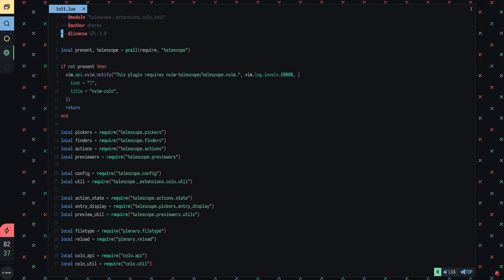

<div align="center">

```txt
Theming utilities for your Neovim.
STATUS: WIP
NVIM: v0.8.0
```

</div>

> <samp>WARN: This plugin is in an early stage and docs are a bit sparse.
  Feel free to try it out though and let me know if you have
  any problems/suggestions.</samp>

<h2><samp>PACKER</samp></h2>

<samp>
Following is a very minimal configuration for colo.
Plenary is the only hard-dependency. You can opt out installing
extensions if you decide not to use them or, prefer your own configuration instead.
</samp>

```lua
use({
  "dharmx/nvim-colo",
  config = function()
    require("colo").setup()
  end,
  requires = {
    "nvim-lua/plenary.nvim",
    "nvim-telescope/telescope.nvim",    -- optional
    "nvim-lua/plenary.nvim",            -- optional
    "nvim-telescope/telescope.nvim",    -- optional
    "feline-nvim/feline.nvim",          -- optional
    "akinsho/bufferline.nvim",          -- optional
    "lewis6991/gitsigns.nvim",          -- optional
    "kyazdani42/nvim-web-devicons",     -- optional
  }
})
```

<h2><samp>CONFIG</samp></h2>

<samp>
Configuration is done by passing a table to the setup function.
The following are the default settings.
</samp>

<details>

<summary><samp>The default configuration.</samp></summary>

```lua
local defaults = {
  -- Neovim theme.
  theme = "radium_dark",
  ---Enable theme cycles and history tracking. This will keep track of previous
  ---and next themes
  ---so you can switch back and forth between them.
  cycle = false,
  ---Skip loading extensions when colo is first loaded i.e. only set the colorscheme.
  manual = false,
  ---Set the inverted version of the theme.
  ---WARN: This will not change the source colors itself. It will only change the
  ---current highlights. So, if one decides to import colors from the theme after
  ---inversion then the imported colors would not be inverted.
  inverted = false,
  ---This sets mappings. Note that mappings.items is just a table that passes values
  ---through |vim.keymap.set()|
  mappings = {
    enable = false,
    items = {
      {
        mode = "n",
        key = ";a",
        action = vim.cmd.ColoPrevious,
        options = {
          silent = true
        }
      },
      {
        mode = "n",
        key = ";s",
        action = vim.cmd.ColoInvert,
        options = {
          silent = true
        }
      },
      {
        mode = "n",
        key = ";d",
        action = vim.cmd.ColoNext,
        options = {
          silent = true
        }
      },
      {
        mode = "n",
        key = "<leader>t",
        action = vim.cmd.ColoTele,
        options = {
          silent = true
        }
      },
    },
  },
  ---Configure builtin extension and your own custom extensions.
  ---Don't install them if all of them are set to false
  extensions = {
    feline = {
      enable = false,
      module = "colo.extensions.feline",
      options = {},
    },
    bufferline = {
      enable = false,
      module = "colo.extensions.bufferline",
      options = {},
    },
    devicons = {
      enable = false,
      module = "colo.extensions.devicons",
      options = {},
    },
  },
  ---Add, remove and toggle font styles for some specific highlights.
  aggregates = {
    enable = false,
    items = {
      bold = false,
      undercurl = false,
      underline = false,
      italic = false,
      transparent = false,
    },
  },
  ---Extra highlights. These will be sourced after overrides.
  custom_hl = {
    enable = false,
    items = {
      LspDiagnosticsSignWarn = { link = "DevIconHtm" },
      LspDiagnosticsSignError = { link = "DevIconJava" },
      LspDiagnosticsSignInfo = { link = "DevIconCobol" },
      LspDiagnosticsSignHint = { link = "DevIconMaterial" },
    },
  },
  ---Special style options.
  presets = {
    enable = false,
    items = {
      italic_comments = false,
      dotted_spell = false,
      contrast = false,
    },
  },
  ---Options regarding the telescope theme picker.
  telescope = {
    theme = "ivy",
    results_title = false,
    sorting_strategy = "ascending",
    layout_strategy = "center",
    layout_config = {
      preview_cutoff = 1,
      width = function(_, max_columns, _)
        return math.min(max_columns, 60)
      end,
      height = function(_, _, max_lines)
        return math.min(max_lines, 20)
      end,
    },
    border = true,
    borderchars = {
      prompt = { "─", "│", " ", "│", "╭", "╮", "│", "│" },
      results = { "─", "│", "─", "│", "├", "┤", "╯", "╰" },
      preview = { "─", "│", "─", "│", "╭", "╮", "╯", "╰" },
    },
    separator = "┃  ",
    ---Exclude theme file patterns that you do not want to show in the picker.
    exclude = {
      "^sexy_",
      "^tempus_",
      "^base16_",
      "^dkeg_",
      "^stardew_",
      "^decay_",
      "^hybrid_",
    },
    ---Highlights for theme categories and variants.
    highlights = {
      ---Theme variant color marking.
      background = {
        dark = "@debug",
        light = "@label",
      },
      ---Theme category color marking.
      pack = {
        ["base16"] = "Operator",
        ["single"] = "Directory",
        ["sexy"] = "Keyword",
        ["decay"] = "Question",
        ["dkeg"] = "Macro",
        ["stardew"] = "Number",
        ["hybrid"] = "Todo",
        ["tempus"] = "Float",
      },
    },
  },
}
```

</details>

<h3><samp>TIPS</samp></h3>

<samp>
Extension caches are needed to be cleared. That is why a `extensions.<extension>.module`
option is given. If you want to use your configuration instead then pass your module
path there.

Additionally, extensions are loaded using a loop. You can take advantage
of this. If you want to integrate another plugin then do the following.
</samp>

```lua
...
config.extensions.example = {
  enable = true,
  module = "my_config.example"
  options = { ... },
}
colo.setup(config)
```

## COMMANDS

Following are the default commands that come with nvim-colo.

- Know about a theme or, set a theme by `:Colo _|<theme_name>`.
- Add a font style or, transparency by `:ColoAdd <aggregate>`.
- Remove a font style or, transparency by `:ColoRemove <aggregate>`.
- Toggle a font style or, transparency `:ColoToggle <aggregate>`.
- Move to the next theme by `:ColoNext`.
- Move to the previous theme by `:ColoPrevious`.
- Remove all highlights by `:ColoClean`.
- Invert current theme or, invert the selected theme by `:ColoInvert _|<theme_name>`.
- Load all or, a specific extension by `:ColoLoadExtension _|<extension_name>`.
- Open the telescope theme picker by `:ColoTele`.
- Enable dotted underline for spelling `:ColoPresetDottedSpell`.
- Enable italic comments `:ColoPresetItalicComments`.
- Add contrasts on Floating windows, sidebars, message pane by `:ColoPresetContrast`.
- Add [nordic.nvim](https://github.com/AlexvZyl/nordic.nvim), [rasmus.nvim](https://github.com/kvrohit/rasmus.nvim),
  nirvana, warm and [boo](https://github.com/rockerBOO/boo-colorscheme-nvim) and [nordic](https://github.com/AlexvZyl/nordic.nvim).
- Support codewindow.nvim, aerial.nvim, harpoon.nvim, grapple.nvim, lazy.nvim,
  leap.nvim, flit.nvim, trouble.nvim, portal.nvim, overseer.nvim, dapui.nvim
  diffview.nvim, jaq.nvim, vim-illuminate, move.nvim, pretty-fold.nvim, vim-sneak,
  lsp-saga.nvim, barbar.nvim and lightspeed.nvim


<h2><samp>GALLERY</samp></h2>

Following are some demo videos of this plugin in action.

<details>

<summary><samp>It's good to use your mouse sometimes. Wink.</samp></summary>

<h3><samp>Set a theme</samp></h3>


<h3><samp>A telescope picker</samp></h3>


<h3><samp>Cycle themes</samp></h3>


<h3><samp>Set a random theme</samp><h3>


<h3><samp>Invert colors of a theme</samp></h3>


<h3><samp>Add contrasts to floating windows, file explorers, cmdline and pmenu</samp></h3>


<h3><samp>Make comments italic</samp></h3>



</details>

<p align="center"><samp><strong>This project is licensed under <a href="https://github.com/dharmx/nvim-colo/blob/main/LICENSE">GPL-3.0</a>.</strong></samp></p>
