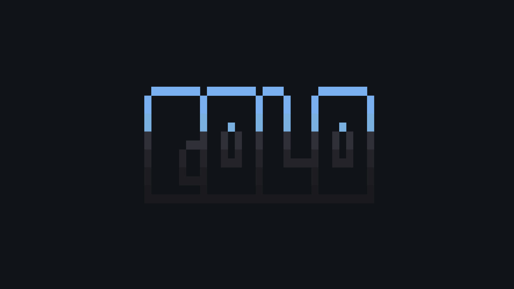

<div align="center">

```txt
Theming utilities for your Neovim.
STATUS: WIP
NVIM: v0.8.0
```

</div>

## TODOS

- Add [nordic.nvim](https://github.com/AlexvZyl/nordic.nvim), [rasmus.nvim](https://github.com/kvrohit/rasmus.nvim), nirvana, warm and [boo](https://github.com/rockerBOO/boo-colorscheme-nvim), [nordic](https://github.com/AlexvZyl/nordic.nvim) and [chocolate](https://gitlab.com/snakedye/chocolate).
- Support codewindow.nvim, aerial.nvim, harpoon.nvim, grapple.nvim, lazy.nvim,
  leap.nvim, flit.nvim, trouble.nvim, portal.nvim, overseer.nvim, dapui.nvim
  diffview.nvim, jaq.nvim, vim-illuminate, move.nvim, pretty-fold.nvim, vim-sneak,
  lsp-saga.nvim, barbar.nvim and lightspeed.nvim.
- Add a colorpicker.
- Add an interactive playground.
- Add acromatic color checker function.
- Add temperature related functions.
- Add cold related functions.
- Add warmth related functions.
- Add contrast related functions.
- Write tests.
- Write guides.
- Refactor `api.lua`.
- Refactor `color.lua`.
- Refactor `extensions`.
- Fix telescope: previews are not showed when results list is empty. (Invalied buffer ID)
- Show a floating window when viewing colorscheme metadata. Allow setting timeouts and theme previews.
- Allow callbacks for some parts of the config.
- Add the following configuration options.
  ```lua
  filetypes = {
    enable = false,
    items = {
      python = "nord_dark",
      lua = "mountain_dark",
      c = "oxocarbon_dark",
    },
  },
  presets = {
    enable = false,
    items = {
      italic_comments = false,
      dotted_spell = false,
      contrast = false,
      swap_kind = false,
      glaze_kind = false,
    },
  },
  ```

</details>

<p align="center"><samp><strong>This project is licensed under <a href="https://github.com/dharmx/nvim-colo/blob/main/LICENSE">GPL-3.0</a>.</strong></samp></p>
